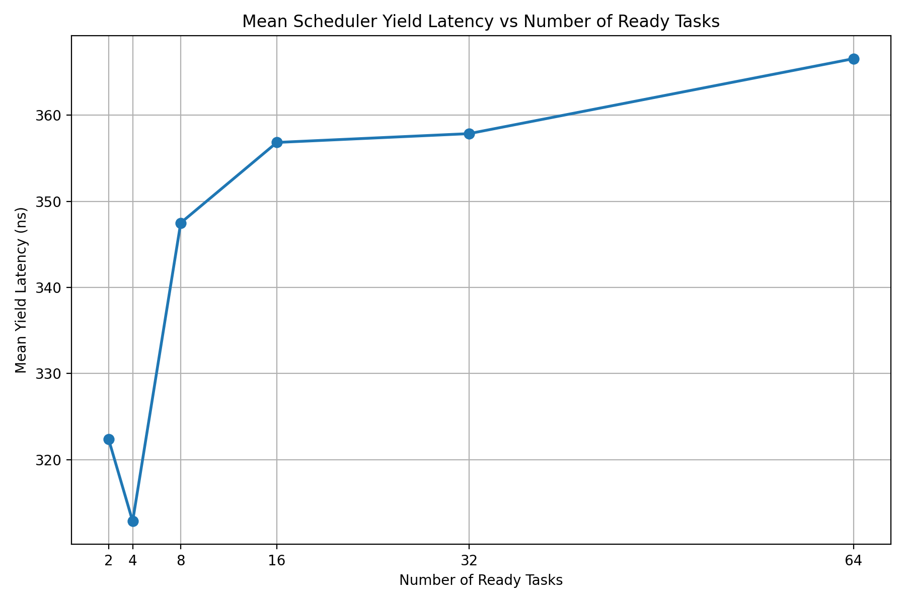
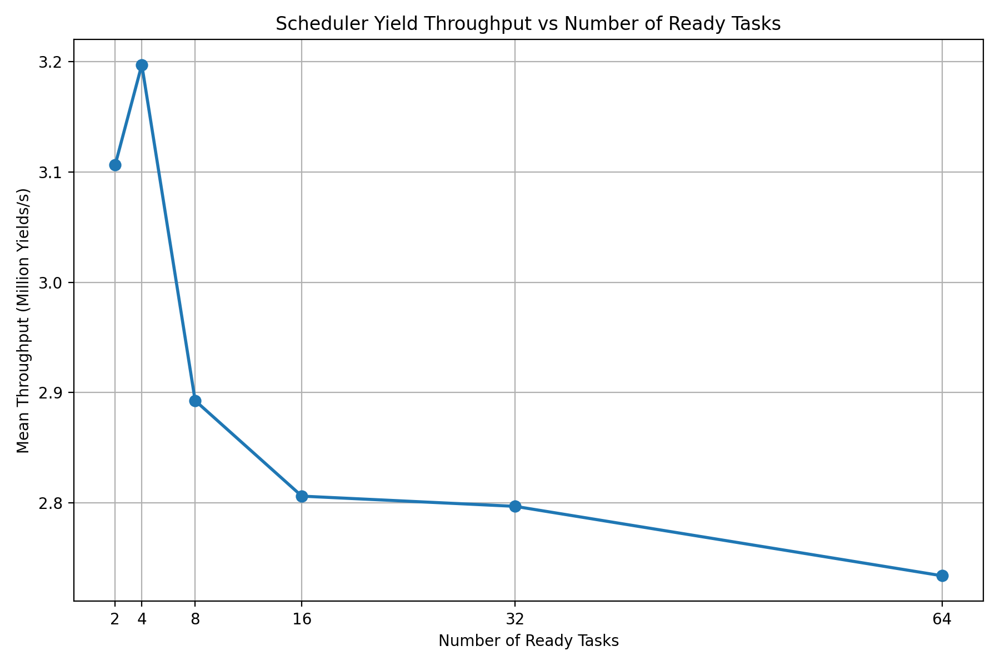
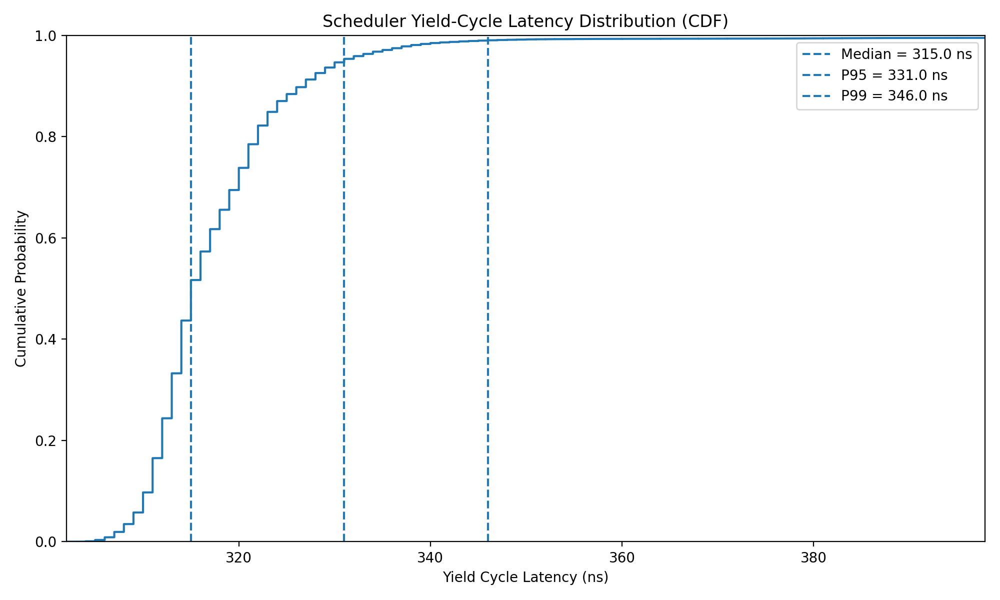
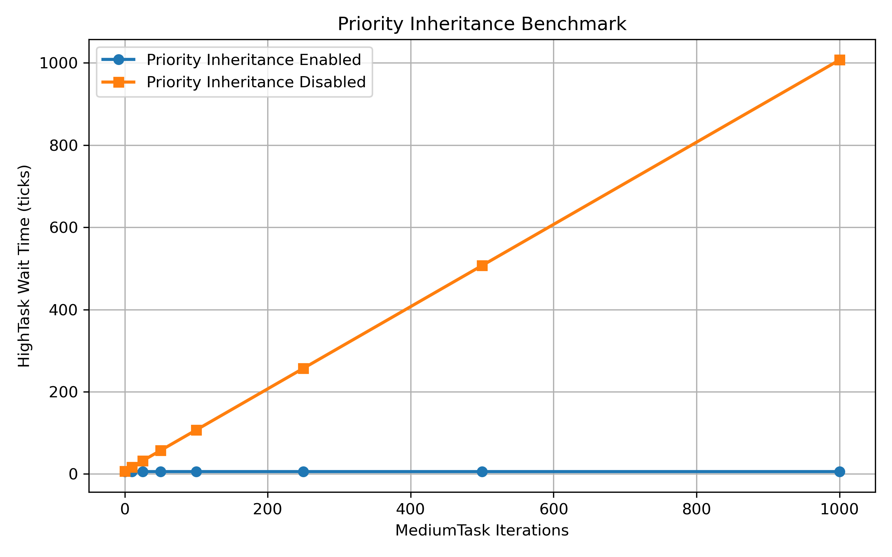
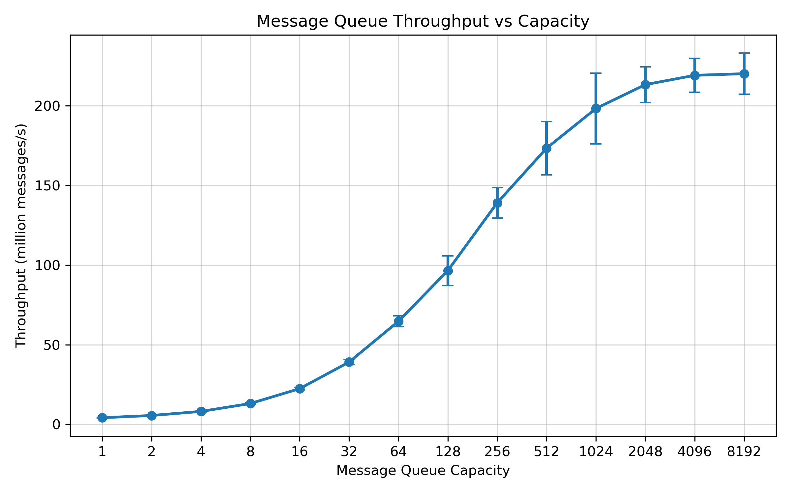
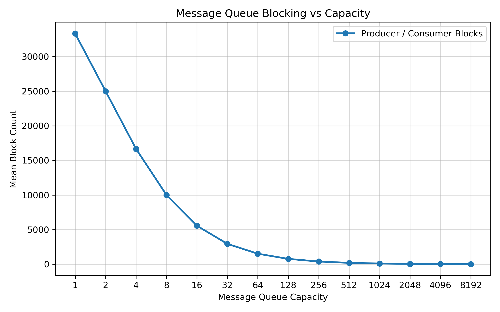

# Mini RTOS Simulator

A C++17 mini RTOS simulator that implements core RTOS kernel scheduling and synchronization primitives using cooperative multitasking with `ucontext`.

This project demonstrates the design and implementation of fundamental RTOS components, including task scheduling, semaphores, mutexes with priority inheritance, deadlock prevention, blocking message queues, and performance benchmarking.

---

# Features

- Priority-based cooperative scheduler
- Multi-level ready queues
- Delayed task scheduling
- Counting semaphore
- Mutex with priority inheritance
- Recursive priority inheritance
- Deadlock detection and prevention
- Bounded blocking message queue
- Priority-ordered sender and receiver wait lists
- FIFO ordering for equal-priority tasks
- Direct message handoff
- Scheduler, mutex, and message queue benchmarking
- C++17 implementation

---

# Project Structure

```text
mini-rtos-simulator
├── docs/
├── examples/
│   └── basic_tasks.cpp
├── include/
│   ├── kernel_access.hpp
│   ├── message_queue.hpp
│   ├── message_queue_api.hpp
│   ├── mutex.hpp
│   ├── rtos.hpp
│   ├── scheduler.hpp
│   ├── scheduler.tpp
│   ├── semaphore.hpp
│   └── task.hpp
├── src/
├── tests/
├── benchmark_results/
├── latency_results/
├── Makefile
└── README.md
```

---

# Architecture

```text
                   +----------------------+
                   |     Application      |
                   +----------------------+
                              |
                              v
                        RTOS API Layer
           createTask / delay / yield / semaphore
                   mutex / message queue
                              |
                              v
                   +----------------------+
                   |      Scheduler       |
                   +----------------------+
                    |        |         |
                    |        |         |
                    v        v         v
             Ready Queue  Delay Queue  Wait Lists
                                       |
                  +--------------------+--------------------+
                  |                    |                    |
                  v                    v                    v
              Semaphore              Mutex            Message Queue
                                       |
                                       v
                              Priority Inheritance
```

---

# Synchronization Primitives

## Semaphore

- Counting semaphore
- Priority-based waiting
- FIFO ordering for equal priorities
- Direct wake-up of waiting tasks

## Mutex

- Ownership tracking
- Priority inheritance
- Recursive priority inheritance
- Multiple owned mutexes
- Waiter priority reordering
- Deadlock detection
- Deadlock prevention

## Message Queue

- Fixed-capacity bounded queue
- Blocking send
- Blocking receive
- Priority-ordered sender waiters
- Priority-ordered receiver waiters
- FIFO ordering for equal priorities
- Direct handoff
- Queue refill from blocked senders

---

# Build

```bash
make
```

Run:

```bash
./mini_rtos
```

---

# Example Output

```text
HighTask waiting for mutex
Priority inheritance: LowTask priority 1 -> 3
Mutex ownership transferred to HighTask

Producer blocked
Consumer received message: 100
Producer resumed
```

---

# Performance Evaluation

Dedicated benchmark programs were used to evaluate scheduler overhead, per-yield latency, priority inheritance behavior, and message queue performance.

Performance benchmarks were compiled with GCC using `-O2` and executed with CPU affinity (`taskset -c 0`). Warm-up runs were performed before collecting measured results where applicable.

## Scheduler Scalability

Each scheduler scalability configuration used **5 warm-up runs**, **50 measured runs**, and **100,000 yield operations per task**.

| Tasks | Mean Yield Latency (ns) | Throughput (yields/s) |
|------:|------------------------:|----------------------:|
| 2 | 322 | 3.11 M |
| 4 | 313 | 3.20 M |
| 8 | 347 | 2.89 M |
| 16 | 357 | 2.81 M |
| 32 | 358 | 2.80 M |
| 64 | 367 | 2.73 M |





---

## Scheduler Latency

A per-yield latency benchmark records every scheduler dispatch and reports median and tail latency (P95/P99), providing a more detailed characterization than average execution time alone.

Representative result (16 runnable tasks):

| Metric | Latency |
|-------|--------:|
| Median | **315 ns** |
| P95 | **331 ns** |
| P99 | **346 ns** |



---

## Priority Inheritance Benchmark

A dedicated benchmark evaluates the impact of priority inheritance on mutex blocking time.

The benchmark creates three tasks:

- **HighTask (priority 3)** attempts to acquire a mutex.
- **MediumTask (priority 2)** performs configurable workloads by repeatedly calling `yield()`.
- **LowTask (priority 1)** holds the mutex while executing a fixed critical section.

The scheduler tick count between the HighTask's mutex request and successful acquisition is recorded.

### Representative Results

| MediumTask Iterations | Priority Inheritance | HighTask Wait Time (ticks) |
|----------------------:|:--------------------:|---------------------------:|
| 10 | Enabled | 6 |
| 10 | Disabled | 17 |
| 100 | Enabled | 6 |
| 100 | Disabled | 107 |
| 500 | Enabled | 6 |
| 500 | Disabled | 507 |
| 1000 | Enabled | 6 |
| 1000 | Disabled | 1007 |



The benchmark demonstrates that enabling priority inheritance keeps the HighTask's mutex wait time nearly constant regardless of the MediumTask workload. Without priority inheritance, the waiting time increases almost linearly with the workload, illustrating the classic priority inversion problem.

---

## Message Queue Capacity Benchmark

The message queue benchmark evaluates how bounded queue capacity affects message throughput and task blocking.

The benchmark creates one equal-priority Producer and one equal-priority Consumer. The total message count is fixed at **100,000 messages**, while the queue capacity is varied from **1 to 8192 entries**.

Each configuration used:

- 5 warm-up runs
- 50 measured runs
- CPU affinity to core 0
- Message checksum validation

### Representative Results

| Queue Capacity | Mean Throughput | Producer Blocks | Consumer Blocks |
|---------------:|----------------:|----------------:|----------------:|
| 1 | ~4.2 M messages/s | 33,333 | 33,333 |
| 8 | ~12.9 M messages/s | 10,000 | 10,000 |
| 64 | ~64 M messages/s | 1,515 | 1,515 |
| 256 | ~139 M messages/s | 387 | 387 |
| 1024 | ~198 M messages/s | 97 | 97 |
| 2048 | ~209 M messages/s | 48 | 48 |
| 4096 | ~219 M messages/s | 24 | 24 |
| 8192 | ~220 M messages/s | 12 | 12 |





Increasing the queue capacity reduces full and empty queue conditions, allowing the Producer and Consumer to process more messages before either task must block.

As blocking frequency decreases, scheduler intervention and context-switching overhead are amortized across larger batches of messages. Throughput increases rapidly up to capacities of approximately **1024 to 2048 entries**, then begins to plateau beyond approximately **2048 to 4096 entries**.

Producer and Consumer block counts are identical in this benchmark because both tasks use the same priority and execute cooperatively until the queue becomes full or empty.

The reported throughput represents in-process message transfers inside the cooperative simulator. It should not be interpreted as network, inter-process, or multi-core communication throughput.

---

## Key Results

- Average scheduler yield cost remained below approximately **370 ns** across **2–64** runnable tasks.
- Median yield-cycle latency remained approximately **310–323 ns**.
- Tail latency remained low under typical runs (**P95 ≈ 330 ns**, **P99 ≈ 350 ns**).
- Scheduler performance remained stable as the number of runnable tasks increased.
- With priority inheritance enabled, the HighTask mutex wait time remained nearly constant (**≈6 ticks**) regardless of the MediumTask workload.
- Without priority inheritance, the HighTask wait time increased approximately linearly with the MediumTask workload, demonstrating the impact of priority inversion.
- Message queue throughput increased from approximately **4.2 million messages/s** at capacity 1 to approximately **220 million messages/s** at capacity 8192.
- Producer and Consumer blocking decreased from approximately **33,333 events** at capacity 1 to approximately **12 events** at capacity 8192.
- Message queue throughput began to plateau beyond capacities of approximately **2048–4096 entries**.

---

## Benchmark Environment

- C++17
- Linux (WSL2 Ubuntu)
- GCC (`-O2`)
- Intel Core i7-1360P
- CPU affinity (`taskset -c 0`)
- Warm-up before measurement
- Per-yield latency profiling

---

# Current Status

## Implemented

- Scheduler
- Multi-level ready queues
- Delayed queue
- Semaphore
- Mutex
- Recursive priority inheritance
- Deadlock prevention
- Message queue
- Scheduler benchmark
- Yield latency benchmark
- Priority inheritance benchmark
- Message queue capacity benchmark

## Planned

- Additional RTOS primitives
- Extended documentation

---

# License

MIT License